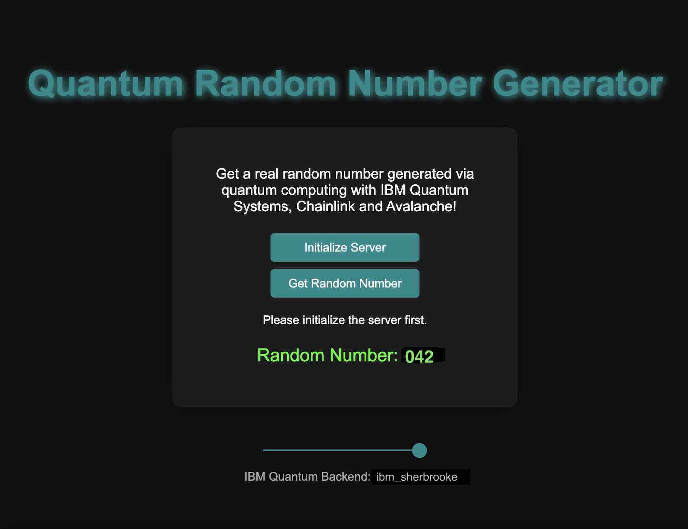
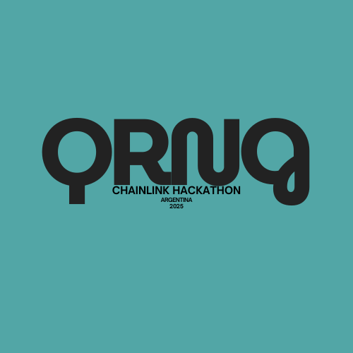

# Quantum Random Number Generator (Chainlink Hackathon 2025)

## Overview

Quantum Random Number Generator (QRNG) is a cross-chain lottery application that generates truly unpredictable three-digit random numbers (e.g., 042) using quantum computing via IBM Quantum Systems. It selects the least busy QPU, and if no QPUs have fewer than 5 jobs in queue, it uses the FakeAlmadenV2 simulator. The application integrates Chainlink Functions to manage API calls and ensure verifiable randomness on the Avalanche blockchain (Fuji testnet), aiming for efficiency with one API call per request. This project demonstrates how quantum computing can enhance decentralized applications by providing true randomness for use cases like lotteries, ensuring transparency and trust.

## Features

- Generates 3-digit random numbers (e.g., 042) using quantum computing.
- Uses Chainlink Functions for integration with Avalanche (Fuji testnet).
- Deployed with Serveo and ngrok for remote access during development and demo.
- Simple user interface to initialize the server and obtain random numbers.

## Tech Stack

- **Quantum Computing**: IBM Quantum (selects the least busy QPU, or FakeAlmadenV2 simulator if QPUs have 5+ jobs in queue) for true randomness.
- **Blockchain**: Chainlink Functions for API calls and Avalanche (Fuji testnet) for cross-chain deployment.
- **Backend**: Node.js with WebSocket (`backend/index.js`) for real-time communication.
- **Frontend**: HTML/CSS/JavaScript for a minimalistic interface.
- **APIs**: `scripts/qrng_api.py` to connect with IBM Quantum.
- **Deployment**: Serveo and ngrok to expose the local servers.

## Prerequisites

- A Metamask wallet configured for the Fuji (Avalanche testnet) with AVAX testnet tokens for transactions.
- Python 3.x with Qiskit 2.0 installed in a virtual environment.
- A Chainlink Functions account with a Subscription ID and LINK balance.
- An IBM Quantum Experience account with an API token.
- Node.js and npm installed for the backend and frontend.

## Setup and Installation

1. Clone the repository:

git clone https://github.com/horca17/QRNG_Chainlink.git

2. Create a Python environment and install Qiskit 2.0:

python3 -m venv qiskit_env
source qiskit_env/bin/activate
pip install qiskit==2.0

3. Install backend dependencies:

cd QRNG_Chainlink/backend
npm install

4. Install frontend dependencies:

cd ../frontend
npm install

5. Configure IBM Quantum credentials in `scripts/qrng_api.py` with your API token. The system will automatically select the least busy QPU, or use the FakeAlmadenV2 simulator if no QPUs have fewer than 5 jobs in queue.
6. Configure your Chainlink Functions Subscription ID in `frontend/script.js`.
7. Use the pre-deployed contract on Fuji (Avalanche testnet) or deploy your own:
- **Option 1: Use the pre-deployed contract**:
  The contract `QuantumOracle.sol` is already deployed on Fuji at the address:

0xaE674AA888eb7E233B6011cAaB56C77Ca0972Aa4

The ABI is harcodeado in `frontend/script.js`. Non-owner users can interact with the contract using the access code `ag736ot`.
- **Option 2: Deploy your own contract**:
Deploy the `QuantumOracle.sol` contract on Fuji using your preferred tool (e.g., Hardhat, Remix). Update `frontend/script.js` with your deployed contract address and ABI.
8. Expose the local servers using Serveo and ngrok (run these in separate terminals):
- **For the backend server** (running on port 5005):

ngrok http 5005

Note: After running ngrok, it will provide a URL (e.g., `https://random-ngrok-url.ngrok-free.app`). Update the frontend configuration (in `frontend/script.js`) to use this URL for backend API calls. If you have a custom ngrok domain, use the `--domain` flag (e.g., `ngrok http --domain=your-custom-domain.ngrok-free.app 5005`).
- **For the frontend** (running on port 3000):

autossh -M 0 -o ServerAliveInterval=30 -o ServerAliveCountMax=3 -R your-subdomain:80:localhost:3000 serveo.net

Note: Replace `your-subdomain` with a unique subdomain of your choice. This will expose the frontend at the chosen subdomain (e.g., `mysubdomain.serveo.net`). If you need to use an SSH key for authentication, add the `-i /path/to/your-key` option. Update the backend configuration (in `backend/index.js`) to allow connections from this URL if needed (e.g., CORS settings).
9. Start the API server:

python3 api_server.py

Monitor the API server logs:

tail -n 5 -f /tmp/api_server.log /tmp/api_server.err

Note: The API server includes automated scripts to keep it running. Check `api_server.py` and `api_server_restart.sh` for details.
10. Start the frontend development server:

cd frontend
npm run dev

11. Validate that everything is running by checking the ngrok and Serveo URLs, and ensure the API server logs show no errors.
12. Open the frontend in your browser at the Serveo URL (e.g., `your-subdomain.serveo.net`).

## Usage

1. Open the frontend in your browser at the Serveo URL (e.g., `your-subdomain.serveo.net`).
2. Click "Initialize Server" to connect to the backend and IBM Quantum system. The red circle 🔴 will turn green 🟢 if the connection is successful. The system will select the least busy QPU from IBM Quantum, or use the FakeAlmadenV2 simulator if no QPUs have fewer than 5 jobs in queue.
3. Click "Get Random Number" to generate a random number. If using a real QPU, this may take several minutes depending on the job queue (e.g., a QPU took 3 seconds to generate a number like 542, with a total wait of less than a minute). If using the FakeAlmadenV2 simulator (due to QPUs having 5+ jobs in queue), the result will be much faster.

## Project Structure

- `contracts/QuantumOracle.sol`: Smart contract for Chainlink Functions integration on Avalanche.
- `backend/index.js`: Backend server logic, including WebSocket for real-time communication.
- `backend/package.json`: Project dependencies for Node.js.
- `scripts/qrng_api.py`: Python script to interact with IBM Quantum API.
- `frontend/index.html`: HTML for the user interface.
- `frontend/styles.css`: Styles for the frontend.
- `frontend/script.js`: Frontend logic in JavaScript.
- `api_server.py`: API server script to handle backend requests.
- `api_server_restart.sh`: Script to automate keeping the API server running.

## Challenges

- **IBM Quantum Costs and Delays**: Limited random numbers to 3 digits to optimize costs, as quantum operations can be expensive. Faced delays in IBM Quantum jobs due to queue times, impacting response speed during live demos.
- **Chainlink Functions API Calls**: Intended to limit API calls to one per request using Chainlink Functions for efficiency, but encountered an issue where four API calls were made instead, increasing costs and latency. This requires further optimization in the `QuantumOracle.sol` contract or backend configuration.
- **Deployment Stability**: Faced connectivity issues with the local server, exacerbated by frequent outages in Serveo and ngrok, resolved by using both tools for reliable exposure of port 3000.
- **WebSocket Issues**: Encountered errors (1011 and 1006) due to timeouts and abnormal closures, mitigated by adjusting keepalive intervals and ensuring stable connectivity with Serveo/ngrok.
- **Resource Constraints**: Experienced performance challenges due to resource-intensive quantum operations and backend processes, which strained system memory and processing on the development machine.

## Demo

1. Initialize the server by clicking "Initialize Server".
2. Once connected, click "Get Random Number".
3. View the quantum-generated random number (e.g., 542) that can be used in the cross-chain lottery.

## Project Media

- Frontend screenshot showing a random number:

- Project logo:

- Architecture diagram (IBM Quantum → Chainlink Functions → Avalanche):

## Future Improvements

- Implement on-chain storage to record generated numbers and their usage in the lottery.
- Enhance the UI with animations and better responsiveness for mobile devices.
- Further optimize API calls to reduce costs in production environments.

## Team

This is a solo project developed by Horacio Cáceres for the Chainlink Hackathon 2025.

## License

MIT License - feel free to use and modify this code as needed.

